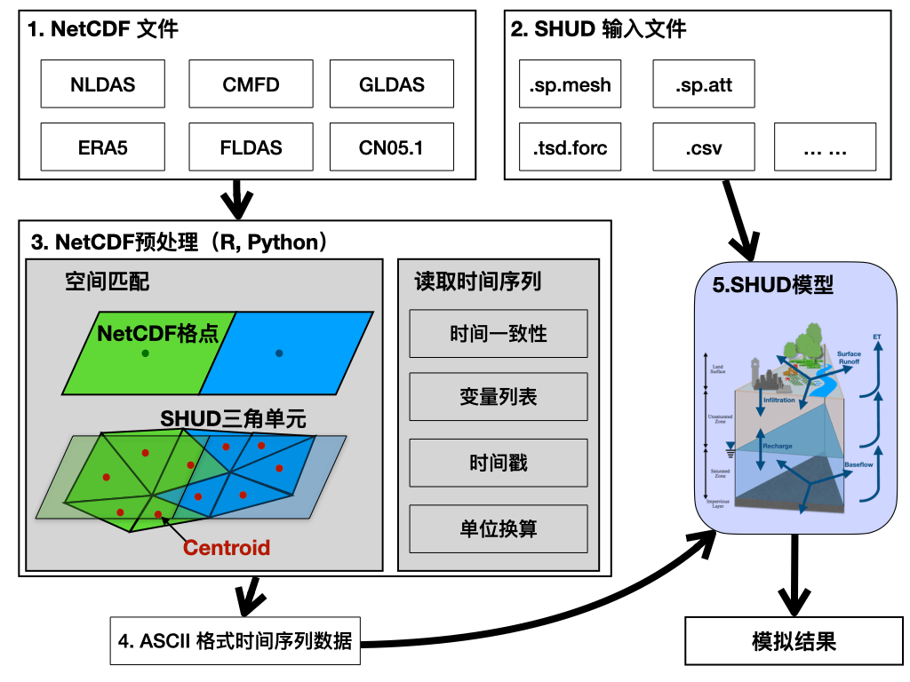

---
# Page title
title: 选题指南

# Title for the menu link if you wish to use a shorter link title, otherwise remove this option.
linktitle: 5. 选题指南

# Page summary for search engineR.
summary: 选题指南

# Date page published
date: 2024-06-03

# Academic page type (do not modify).
type: book

# Position of this page in the menu. Remove this option to sort alphabetically.
weight: 900

---

项目可分为指南任务和自由选题两部分。

- 部分指南任务的描述较为详细，一部分仅为一个题目。具体的实施方案请思考并与本研究组沟通。
- 自由选题方向请注意：仅限**大气、水文、地理、遥感、生态**方向，以及与以上方向有交叉的**计算机、高性能计算、人工智能、软硬件设备**等。项目中请优先使用SHUD模型。
恕能力限制，其他方向无法提供学术指导和经费支持。

任务分为两类：

- 以**R.** 开头的项目属于**研究性任务**，需要发表研究论文方能结题
- 以**D**开头的项目是应用**实践性任务**，主要涉及数据处理、设备研发和程序开发，主要的成果形式是软著和专利。

## 5.1 自由选题

请自由发挥，但建议选题之后，先于本研究组PI联系，看是否有资助意向。

## 5.2 指南任务列表

以下为指南任务，我们主要提供一个研究的主题或者思路，由申请者来寻找具体的路径去实现，实现的方法非常灵活。 

### 5.2.1研究类任务

####  **R. Rum River水文模拟**

Rum River是美国密西西比河上游区域的一个子流域。该流域面积约4000平方公里，上游存在一个大湖。

路径：

1. 利用1979-2023年的小时尺度NLDAS数据和SHUD模型对Rum River的径流进行模拟。
2. 模拟结果要求可靠的（多个水文站）径流、地下水空间分布和时间变化.
3. 分析和总结Rum River的各个子流域的地理特征（坡度、坡向等）。
4. 初步使用LSTM和GraphNET等深度学习方法进行子流域径流模拟。

难点：

1. 时间序列较长。
2. 需要收集NWIS发布的各水文数据。
3. 需要有较好的英文基础，与美国的合作者定期(每周一次)组会

技能要求：

1. 具有较强的英文听说读写能力。
2. 能够快速使用R语言。
3. 懂地理和水文数据
4. 能运行简单的深度学习模型

#### **R. 区域历史径流再分析资料生成**

针对特定的流域，使用SHUD模型和再分析气象资料，进行长期径流模拟。

路径：

1. 构建流域SHUD模型。
2. 使用径流、地下水、蒸发等数据对模型进行校准和验证
3. 开展长时间序列数据模拟
4. 分析长期水文演变特征。

#### **R. SHUD模型在湿地研究中的应用**

利用SHUD模型进行湿地面积、储水量、水源涵养功能方面的评价和应用研究。

路径：

1. 选择代表性湿地作为研究区域
2. 通过径流、地下水、和蒸发数据对SHUD模型模拟效果进行验证
3. 分析区域湿地的形成因素和长时间序列下湿地的变化特征。
4. 解析湿地变化特征下的各水文要素的影响。

难点：

1. SHUD模型的构建和建模
2. 模型调参的过程和数据准备

技能要求：

1. 会使用R，Python之一
2. 能够读懂C/C++代码，能够进行debug。

#### **R. 黑河流域地表-地下水交互过程的模拟研究**
使用SHUD模型对祁连山黑河流域的地表地下水交互过程进行研究。

路径：
1. 构建黑河流域SHUD模型。
2. 使用径流和地下水位进行调参。
3. 分析中下游地表地下水的交互过程

难点：

1. SHUD模型的构建和建模
2. 模型调参的过程和数据准备
3. 黑河中下游地下水位观测点数据获取。

#### **R. SHUD在无观测流域中的应用。**

在物理模型中，水文模拟的主要障碍是参数的不确定性。在理论上，当参数不确定性消失，那么，物理模型应当是“防止四海皆准”而不需要处处分别校准。

路径：

1. 测试SHUD模型的参数敏感性
2. 利用全球公开的流域径流数据，开展SHUD模型的校准
3. 寻找多流域参数公约数
4. 参数移植至无观测流域的检验

难点：

1. 流域选择非常多。
2. 多个流域的模型的快速构建
3. 模型校准耗时
4. 结果不确定性大

技能要求：

1. 会使用R，Python之一
2. 能够读懂C/C++代码，能够进行debug。
3. 有充足的水文和地理学背景
4. 有强大的逻辑分析能力

#### **R. SHUD模型在山洪预报中的应用**

使用山洪对历史多次山洪事件进行模拟和重现

路径：

1. 搜集近年来的山洪事件，筛选可用于研究的山洪事件。
2. 使用AutoSHUD，快速构建SHUD模型。
3. 利用可用数据对各次山洪数据进行模拟。
4. 对SHUD模型在山洪模拟中的作用和价值做出评估

难点：

1. 山洪往往发生在无观测区域，没有可靠的验证数据。
2. 降雨数据是山洪模拟的关键信息。

技能要求：

1. 能读懂多普勒雷达降雨图，知道单位如何转换。
2. 能够快速使用R语言。
3. 对山洪和洪水有理解。

#### **R. 历史气候资料降尺度**

利用百年尺度的历史气候资料，对南美危地马拉Tikal国家公园的区域进行气候降尺度数据生成。

路径：

1. 收集公元700-1200年间Tikal国家公园的气候资料。
2. 利用不同的降尺度方法生成降尺度数据
3. 对降尺度数据进行评估。

难点：

1. 降尺度数据的可靠性。
2. 对于历史气候数据进行降尺度，不确定性高

**技能要求：**

1. 会使用降尺度方法
2. 能够快速搜索多学科文献
3. 具有古气候变化的基本研究背景

#### **R. SHUD模型最优分辨率问题，网格无关性问题**

需要回答在不同的流域径流模拟中，最优的空间分辨率是什么？

**问题**

1. 不同流域的最优分辨率是多少？
2. 是否存在网格无关性(mesh independance)?

#### **R. 模型的预热期究竟需要多长？**

不同的模型的预热期不同，这其中是否有统一的规律？

#### **R. 评价模型的GOF的正确认识？**

各种拟合优度函数(GOF，goodness of fitting)自身是否存在局限性和倾向性？对模拟结果评价时，如何选取合适合理的GOF函数？

技能要求：

1. 较好的统计基础理论
2. 熟练使用R或Python

#### **R. 利用分形理论研究径流的记忆效应**
利用分形理论研究径流的记忆效应，需要使用分数阶微分方程。

技能要求：

1. 对数学水文要求很高

#### **R. 当前地表地下过程耦合的数值方法水文模型技术综述**

对当前”地表-地下过程耦合的数值方法水文模型“的技术性综述，包括ParFlow, PIHM/SHUD, OpenGeoSphere, HydroGeoSphere, imHM, tRIBS, MIKE-SHE, CATHY, PAWS等等。

## 5.2.2 实践和开发类任务

#### **D. SHUD模型中NetCDF输入输出模块**

给SHUD模型加入支持读取NetCDF格式气象数据的模块。

当前SHUD模型的驱动数据制备如下图所示，需要NetCDF预处理程序，读取时间序列数据并生成可读的数据文件，然后驱动SHUD模型进行模拟。

本任务的目标是实现以下的方式：

技能要求：

1. 懂C/C++
2. 能快速了解NetCDF数据结构
2. 了解GIS和空间数据

#### **D. 全球水文云计算平台中多模型集成任务**

GHDC(https://ghdc.ac.cn)网站可以为用户提供自动化的全球水文建模数据获取和水文建模任务，但是现在这个平台仅支持SHUD模型的自动化建模。因此本任务需要在当前网站数据流程框架下，开发其他模型支持模块，例如SWAT, TOPMODEL, 等等。

技能要求：

1. 精通Python, R之一
2. 懂水文建模，至少初步经验

#### **D. 全球水文云计算平台中API测试和改进任务**

GHDC(https://ghdc.ac.cn)网站可以为用户提供自动化的全球水文建模数据获取和水文建模任务。

GHDC服务支持网页和API方式提交数据，但是API模块仍然需要诸多的测试和改进。 

技能要求：

1. 精通Python
2. 会用R
3. 会前台网页服务

*注：此任务有专业老师指导完成。

#### **D. 在超算上实现CMA-ES多节点并行算法。**

当前我们在R上使用doParall和doMC将计算任务提交至超算允许，但是这种方式仅限单节点多线程并行计算。原因是R上doMC并行算法限制——即使申请了多节点计算资源，也无法调用多个节点，导致”一节点受难，多节点围观“的现象。

因此，我们需要一个新的脚本或者程序，将并行计算任务均匀分配到不同的计算节点上去。可以使用R或者Python实现。

技能要求：

1. 精通并行计算，知道多节点并行和单节点并行的区别。
2. 精通R或者Python之一。

#### **D. 测试和改进SHUD模型的OpenMP并行算法**

当前SHUD模型已经支持OpenMP并行算法，编译结果为shud-omp，但是其计算结果尚未经过验证。因此需要先将单线程的shud和多线程的shud-omp结果进行对比，确保多线程结果与单线程一致，进一步需要提升shud-omp的效率，寻找最优方案。

技能要求：

1. 精通并行计算
2. 精通C/C++

#### **D. 生产全国水文模拟系统的输入数据**

