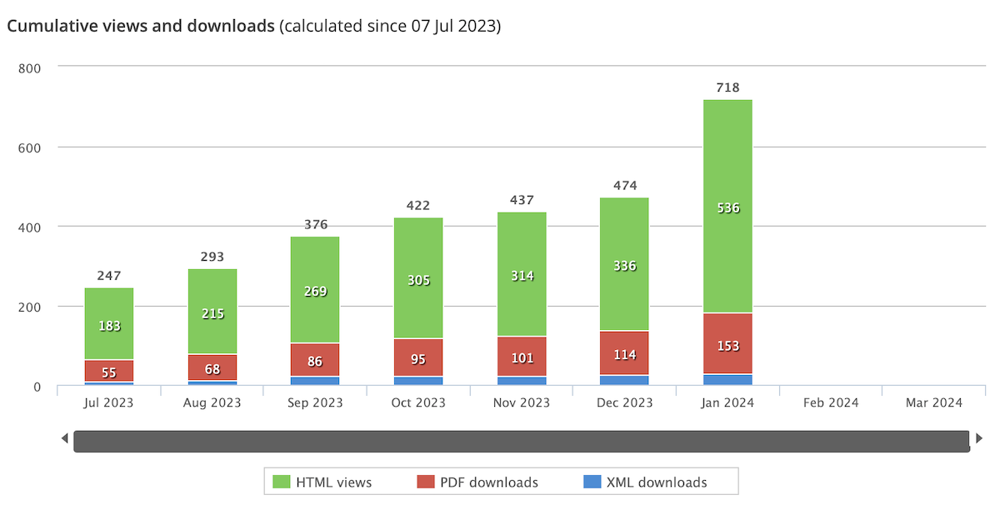

+++
title = "rSHUD建模工具文章Geoscientific Model Development"
date = "2020-06-18"
draft = false

# Tags and categories
# For example, use `tags = []` for no tags, or the form `tags = ["A Tag", "Another Tag"]` for one or more tags.
tags = ["News", "Website", "SHUD", "rSHUD", "水文模型"]
categories = []

# Featured image
# To use, add an image named `featured.jpg/png` to your page's folder.
[image]
  # Caption (optional)
  caption = ""

  # Focal point (optional)
  # Options: Smart, Center, TopLeft, Top, TopRight, Left, Right, BottomLeft, Bottom, BottomRight
  focal_point = ""
+++
SHUD模型描述文章初稿撰写于2018至2023年，2023年6月投出，2024年1月正式发表。

初印本文章以及积累了700余次阅读量，预计未来阅读量会继续提升。

Web page: https://gmd.copernicus.org/articles/17/497/2024/gmd-17-497-2024.html

PDF link: https://gmd.copernicus.org/articles/17/497/2024/gmd-17-497-2024.pdf

文章摘要：

Hydrological modeling is a crucial component in hydrology research, particularly for projecting future scenarios. However, achieving reproducibility and automation in distributed hydrological modeling research for modeling, simulation, and analysis is challenging. This paper introduces rSHUD v2.0, an innovative, open-source toolkit developed in the R environment to enhance the deployment and analysis of the Simulator for Hydrologic Unstructured Domains (SHUD). The SHUD is an integrated surface–subsurface hydrological model that employs a finite-volume method to simulate hydrological processes at various scales. The rSHUD toolkit includes pre- and post-processing tools, facilitating reproducibility and automation in hydrological modeling. The utility of rSHUD is demonstrated through case studies of the Shale Hills Critical Zone Observatory in the USA and the Waerma watershed in China. The rSHUD toolkit's ability to quickly and automatically deploy models while ensuring reproducibility has facilitated the implementation of the Global Hydrological Data Cloud (https://ghdc.ac.cn), a platform for automatic data processing and model deployment. This work represents a significant advancement in hydrological modeling, with implications for future scenario projections and spatial analysis.

摘要翻译：

